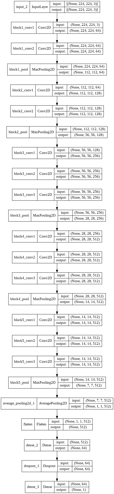
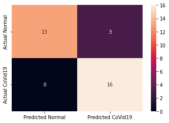
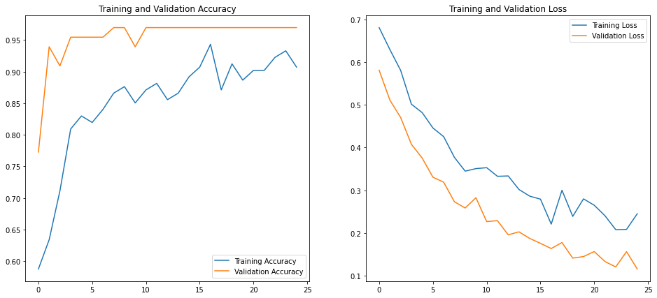

```python
## Authenticate and mount Google Drive
from google.colab import drive
drive.mount('/content/drive')
```

    Mounted at /content/drive
    


```python
%cd /content/drive/My Drive/X_ray_photos/
```

    /content/drive/My Drive/X_ray_photos
    


```python
!ls
```

    covid19  foo.png  model.png  normal  test  train  validation
    

### Importing libraries


```python
import tensorflow as tf

from tensorflow.keras.preprocessing.image import ImageDataGenerator
from tensorflow.keras.applications import VGG16


import os
import glob
import shutil
import numpy as np
import pandas as pd
import matplotlib.pyplot as plt
```


```python
base_dir = !pwd
base_dir = base_dir[0]
print(base_dir)
print(type(base_dir))
```

    /content/drive/My Drive/X_ray_photos
    <class 'str'>
    


```python
# classes = ['covid19', 'normal']
```


```python
# # The code below creates a train and a val folder each containing 2 folders (one for each type of X_ray image).
# # It then copies the images from the original folders to these new folders such that 75% of the images go
# # to the training set and 25% of the images go into the validation set.

# for i in classes:

#   os.makedirs(base_dir +'/train/' + i)
#   os.makedirs(base_dir +'/validation/' + i)
#   source = base_dir + '/' + i
#   allFileNames = os.listdir(source)
#   np.random.shuffle(allFileNames)
#   test_ratio = 0.25

#   train_FileNames, test_FileNames = np.split(np.array(allFileNames),
#                                                       [int(len(allFileNames)* (1 - test_ratio))])

#   train_FileNames = [source+'/'+ name for name in train_FileNames.tolist()]
#   test_FileNames = [source+'/' + name for name in test_FileNames.tolist()]

#   for name in train_FileNames:
#     shutil.copy(name, base_dir +'/train/' + i)

#   for name in test_FileNames:
#     shutil.copy(name, base_dir +'/validation/' + i)
```


```python
!ls
```

    covid19  foo.png  model.png  normal  test  train  validation
    


```python
# Setting paths for training an validation sets
train_dir = os.path.join(base_dir, 'train')
val_dir = os.path.join(base_dir, 'validation')
test_dir = os.path.join(base_dir, 'test')
```


```python
print(train_dir)
print(val_dir)
print(test_dir)
print(type(train_dir))
```

    /content/drive/My Drive/X_ray_photos/train
    /content/drive/My Drive/X_ray_photos/validation
    /content/drive/My Drive/X_ray_photos/test
    <class 'str'>
    


```python
BATCH_SIZE = 15  # Number of training examples to process before updating our models variables
IMG_SHAPE  = 224  # Our training data consists of images with width of 180 pixels and height of 180 pixels
```


```python
def plotImages(images_arr):
    fig, axes = plt.subplots(1, 5, figsize=(20,20))
    axes = axes.flatten()
    for img, ax in zip(images_arr, axes):
      img = img.reshape((224,224))
      ax.imshow(img, cmap='gray')
    plt.tight_layout()
    plt.show()
```


```python
# Read images from the disk.
# Decode contents of these images and convert it into proper grid format as per their RGB content.
# Convert them into floating point tensors.
# Rescale the tensors from values between 0 and 255 to values between 0 and 1, 
# as neural networks prefer to deal with small input values.
image_gen_train = ImageDataGenerator(rescale=1./255,
                    rotation_range=45,                   
                    horizontal_flip=True,
                    zoom_range=0.5
                    )

train_data_gen = image_gen_train.flow_from_directory(
                                                batch_size=BATCH_SIZE,
                                                directory=train_dir,
                                                shuffle=True,
                                                target_size=(IMG_SHAPE, IMG_SHAPE),
                                                class_mode='binary' 
                                                )
```

    Found 194 images belonging to 2 classes.
    


```python
print(train_data_gen[0][0].shape)
```

    (15, 224, 224, 3)
    


```python
augmented_images = [train_data_gen[0][0][0] for i in range(5)]
```


```python
# plotImages(augmented_images)
```


```python
image_gen_val = ImageDataGenerator(rescale=1./255)

val_data_gen = image_gen_val.flow_from_directory(batch_size=BATCH_SIZE,
                                                 directory=val_dir,
                                                 shuffle=False,
                                                 target_size=(IMG_SHAPE, IMG_SHAPE),
                                                 class_mode='binary')

test_data_gen = image_gen_train.flow_from_directory(batch_size=BATCH_SIZE,
                                                 directory=test_dir,
                                                 shuffle=False,
                                                 target_size=(IMG_SHAPE, IMG_SHAPE),
                                                 class_mode='binary')
```

    Found 66 images belonging to 2 classes.
    Found 32 images belonging to 2 classes.
    


```python
val_data_gen[2][1].shape
```


    (15,)


```python
sample_training_images, _ = next(train_data_gen) 

# next function returns a batch from the dataset. One batch is a tuple of (many images, many labels).
# For right now, we're discarding the labels because we just want to look at the images.
```


```python
# plotImages(sample_training_images[:5])  # Plot images 0-4
```

### Creating model


```python
from tensorflow.keras.models import Sequential
from tensorflow.keras.layers import Dense, Conv2D, Flatten, Dropout, MaxPooling2D
from tensorflow.keras.layers import BatchNormalization, Activation, AveragePooling2D
import math
from tensorflow.keras.layers import Input
from tensorflow.keras.models import Model
from tensorflow.keras.optimizers import Adam

```


```python
baseModel = VGG16(weights="imagenet", include_top=False, input_tensor=Input(shape=(224, 224, 3)))

# construct the head of the model that will be placed on top of the
# the base model
headModel = baseModel.output
headModel = AveragePooling2D(pool_size=(4, 4))(headModel)
headModel = Flatten(name="flatten")(headModel)
headModel = Dense(64, activation="relu")(headModel)
headModel = Dropout(0.5)(headModel)
headModel = Dense(1, activation="sigmoid")(headModel)
# place the head FC model on top of the base model (this will become
# the actual model we will train)
model = Model(inputs=baseModel.input, outputs=headModel)
# loop over all layers in the base model and freeze them so they will
# *not* be updated during the first training process
for layer in baseModel.layers:
	layer.trainable = False
```


```python
# cnn = Sequential()

# cnn.add(Conv2D(32, (3, 3), activation="relu", input_shape=(IMG_SHAPE, IMG_SHAPE, 1)))
# cnn.add(MaxPooling2D(pool_size = (2, 2)))

# cnn.add(Conv2D(32, (3, 3), activation="relu", input_shape=(IMG_SHAPE, IMG_SHAPE, 1)))
# cnn.add(MaxPooling2D(pool_size = (2, 2)))

# cnn.add(Conv2D(32, (3, 3), activation="relu", input_shape=(IMG_SHAPE, IMG_SHAPE, 1)))
# cnn.add(MaxPooling2D(pool_size = (2, 2)))

# cnn.add(Conv2D(64, (3, 3), activation="relu", input_shape=(IMG_SHAPE, IMG_SHAPE, 1)))
# cnn.add(MaxPooling2D(pool_size = (2, 2)))

# cnn.add(Conv2D(64, (3, 3), activation="relu", input_shape=(IMG_SHAPE, IMG_SHAPE, 1)))
# cnn.add(MaxPooling2D(pool_size = (2, 2)))

# cnn.add(Flatten())

# cnn.add(Dense(activation = 'relu', units = 128))
# cnn.add(Dense(activation = 'relu', units = 64))

# cnn.add(Dense(activation = 'sigmoid', units = 1))
```


```python
# compile our model
EPOCHS = 25
INIT_LR = 1e-3
opt = Adam(lr=INIT_LR, decay=INIT_LR / EPOCHS)

print("[INFO] compiling model...")

model.compile(loss="binary_crossentropy", optimizer=opt,
	metrics=["accuracy"])
# train the head of the network

print("[INFO] training head...")

```

    [INFO] compiling model...
    [INFO] training head...
    

    /usr/local/lib/python3.7/dist-packages/keras/optimizer_v2/adam.py:105: UserWarning: The `lr` argument is deprecated, use `learning_rate` instead.
      super(Adam, self).__init__(name, **kwargs)
    


```python
history = model.fit_generator(
    train_data_gen,
    epochs=EPOCHS,
    validation_data=val_data_gen
    )
```

    /usr/local/lib/python3.7/dist-packages/ipykernel_launcher.py:4: UserWarning: `Model.fit_generator` is deprecated and will be removed in a future version. Please use `Model.fit`, which supports generators.
      after removing the cwd from sys.path.
    

    Epoch 1/25
    13/13 [==============================] - 101s 7s/step - loss: 0.6805 - accuracy: 0.5876 - val_loss: 0.5809 - val_accuracy: 0.7727
    Epoch 2/25
    13/13 [==============================] - 7s 508ms/step - loss: 0.6291 - accuracy: 0.6340 - val_loss: 0.5108 - val_accuracy: 0.9394
    Epoch 3/25
    13/13 [==============================] - 7s 507ms/step - loss: 0.5804 - accuracy: 0.7113 - val_loss: 0.4702 - val_accuracy: 0.9091
    Epoch 4/25
    13/13 [==============================] - 7s 509ms/step - loss: 0.5013 - accuracy: 0.8093 - val_loss: 0.4075 - val_accuracy: 0.9545
    Epoch 5/25
    13/13 [==============================] - 7s 517ms/step - loss: 0.4817 - accuracy: 0.8299 - val_loss: 0.3754 - val_accuracy: 0.9545
    Epoch 6/25
    13/13 [==============================] - 7s 519ms/step - loss: 0.4457 - accuracy: 0.8196 - val_loss: 0.3306 - val_accuracy: 0.9545
    Epoch 7/25
    13/13 [==============================] - 7s 520ms/step - loss: 0.4254 - accuracy: 0.8402 - val_loss: 0.3189 - val_accuracy: 0.9545
    Epoch 8/25
    13/13 [==============================] - 7s 498ms/step - loss: 0.3769 - accuracy: 0.8660 - val_loss: 0.2731 - val_accuracy: 0.9697
    Epoch 9/25
    13/13 [==============================] - 7s 513ms/step - loss: 0.3447 - accuracy: 0.8763 - val_loss: 0.2585 - val_accuracy: 0.9697
    Epoch 10/25
    13/13 [==============================] - 7s 512ms/step - loss: 0.3506 - accuracy: 0.8505 - val_loss: 0.2825 - val_accuracy: 0.9394
    Epoch 11/25
    13/13 [==============================] - 7s 511ms/step - loss: 0.3528 - accuracy: 0.8711 - val_loss: 0.2266 - val_accuracy: 0.9697
    Epoch 12/25
    13/13 [==============================] - 7s 510ms/step - loss: 0.3326 - accuracy: 0.8814 - val_loss: 0.2289 - val_accuracy: 0.9697
    Epoch 13/25
    13/13 [==============================] - 7s 504ms/step - loss: 0.3335 - accuracy: 0.8557 - val_loss: 0.1957 - val_accuracy: 0.9697
    Epoch 14/25
    13/13 [==============================] - 7s 524ms/step - loss: 0.3018 - accuracy: 0.8660 - val_loss: 0.2027 - val_accuracy: 0.9697
    Epoch 15/25
    13/13 [==============================] - 7s 519ms/step - loss: 0.2862 - accuracy: 0.8918 - val_loss: 0.1873 - val_accuracy: 0.9697
    Epoch 16/25
    13/13 [==============================] - 7s 522ms/step - loss: 0.2792 - accuracy: 0.9072 - val_loss: 0.1758 - val_accuracy: 0.9697
    Epoch 17/25
    13/13 [==============================] - 7s 516ms/step - loss: 0.2209 - accuracy: 0.9433 - val_loss: 0.1637 - val_accuracy: 0.9697
    Epoch 18/25
    13/13 [==============================] - 7s 516ms/step - loss: 0.3000 - accuracy: 0.8711 - val_loss: 0.1777 - val_accuracy: 0.9697
    Epoch 19/25
    13/13 [==============================] - 7s 526ms/step - loss: 0.2389 - accuracy: 0.9124 - val_loss: 0.1413 - val_accuracy: 0.9697
    Epoch 20/25
    13/13 [==============================] - 7s 508ms/step - loss: 0.2799 - accuracy: 0.8866 - val_loss: 0.1449 - val_accuracy: 0.9697
    Epoch 21/25
    13/13 [==============================] - 7s 513ms/step - loss: 0.2650 - accuracy: 0.9021 - val_loss: 0.1566 - val_accuracy: 0.9697
    Epoch 22/25
    13/13 [==============================] - 7s 512ms/step - loss: 0.2404 - accuracy: 0.9021 - val_loss: 0.1332 - val_accuracy: 0.9697
    Epoch 23/25
    13/13 [==============================] - 7s 514ms/step - loss: 0.2078 - accuracy: 0.9227 - val_loss: 0.1207 - val_accuracy: 0.9697
    Epoch 24/25
    13/13 [==============================] - 7s 508ms/step - loss: 0.2084 - accuracy: 0.9330 - val_loss: 0.1565 - val_accuracy: 0.9697
    Epoch 25/25
    13/13 [==============================] - 7s 521ms/step - loss: 0.2451 - accuracy: 0.9072 - val_loss: 0.1157 - val_accuracy: 0.9697
    

### Visualizing CNN model


```python
from tensorflow.keras.utils import plot_model
plot_model(model,show_shapes=True, show_layer_names=True, rankdir='TB', expand_nested=True)
```


    

    


### Prediction and Results


```python
test_accu = model.evaluate(test_data_gen)
print('The testing accuracy is :',test_accu[1]*100, '%')
```

    3/3 [==============================] - 10s 5s/step - loss: 0.2084 - accuracy: 0.9062
    The testing accuracy is : 90.625 %
    


```python
preds = model.predict(test_data_gen,verbose=1)
predictions = preds.copy()
predictions[predictions <= 0.5] = 0
predictions[predictions > 0.5] = 1
```

    3/3 [==============================] - 1s 345ms/step
    


```python
from sklearn.metrics import classification_report,confusion_matrix

cm = pd.DataFrame(data=confusion_matrix(test_data_gen.classes, predictions, labels=[0, 1]),index=["Actual Normal", "Actual CoVid19"],
columns=["Predicted Normal", "Predicted CoVid19"])

import seaborn as sns
sns.heatmap(cm,annot=True,fmt="d")
```


    <matplotlib.axes._subplots.AxesSubplot at 0x7fa488d0ad90>


    

    


```python
print(classification_report(y_true=test_data_gen.classes,y_pred=predictions,target_names =['NORMAL','CoVid19']))
```

                  precision    recall  f1-score   support
    
          NORMAL       1.00      0.81      0.90        16
         CoVid19       0.84      1.00      0.91        16
    
        accuracy                           0.91        32
       macro avg       0.92      0.91      0.91        32
    weighted avg       0.92      0.91      0.91        32
    
    


```python
acc = history.history['accuracy']
val_acc = history.history['val_accuracy']

loss = history.history['loss']
val_loss = history.history['val_loss']

epochs_range = range(EPOCHS)

plt.figure(figsize=(16, 7))
plt.subplot(1, 2, 1)
plt.plot(epochs_range, acc, label='Training Accuracy')
plt.plot(epochs_range, val_acc, label='Validation Accuracy')
plt.legend(loc='lower right')
plt.title('Training and Validation Accuracy')

plt.subplot(1, 2, 2)
plt.plot(epochs_range, loss, label='Training Loss')
plt.plot(epochs_range, val_loss, label='Validation Loss')
plt.legend(loc='upper right')
plt.title('Training and Validation Loss')
plt.savefig('./foo2.png')
plt.show()
```


    

    

